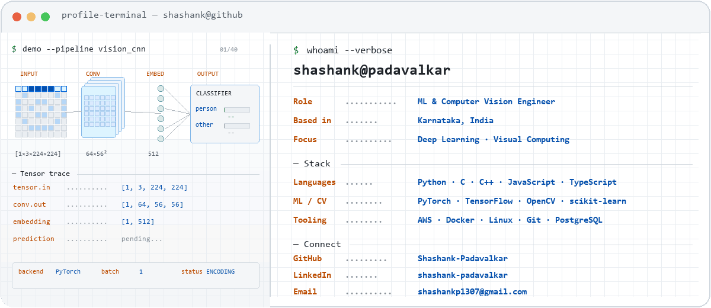

  <picture>
    <source media="(prefers-color-scheme: dark)" srcset="assets/profile-terminal-dark.gif" />
    <source media="(prefers-color-scheme: light)" srcset="assets/profile-terminal-light.gif" />
    
  </picture>
    
  
  

---

## About Me

- 🤖 I work at the intersection of **machine learning** and **computer vision**.
- 🧠 My interests include intelligent systems, deep learning, and visual computing.
- 📍 Based in Karnataka, India.

## Languages and Tools

### Machine Learning & Computer Vision

  &nbsp;
  &nbsp;
  &nbsp;
  &nbsp;
  &nbsp;
  &nbsp;
  

### Programming Languages & Runtime

  &nbsp;
  &nbsp;
  &nbsp;
  &nbsp;
  

### Cloud, DevOps & Data

  &nbsp;
  &nbsp;
  &nbsp;
  &nbsp;
  &nbsp;
  &nbsp;
  

### Product, Design & Hardware

  &nbsp;
  &nbsp;
  &nbsp;
  &nbsp;
  &nbsp;
  

---

  <em>Thanks for visiting!</em>

